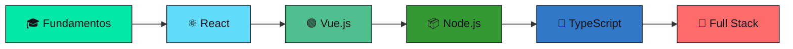

<div align="center">
  
</div>

<!-- Typing SVG -->
<div align="center">
  <a href="https://git.io/typing-svg"></a>
</div>

<br/>

<!-- Social badges con animación hover -->
<div align="center">
  <a href="https://www.linkedin.com/in/alvaro-escobar-martín-a3351b241/" target="_blank">
    
  </a>
  <a href="https://www.instagram.com/aalvarooescobar/" target="_blank">
    
  </a>
  <a href="https://www.tiktok.com/@elvaro_69" target="_blank">
    
  </a>
  <a href="https://www.facebook.com/profile.php?id=100072663426403" target="_blank">
    
  </a>
  <a href="mailto:tu-email@ejemplo.com" target="_blank">
    
  </a>
</div>

<br/>

<!-- Contador de visitas -->
<div align="center">
  
  
</div>

<br/>

<!-- Línea divisoria animada -->


##  Sobre Mí

```javascript
const alvaro = {
    ubicacion: "España 🇪🇸",
    estudiando: "Informática 💻",
    pasiones: ["Programación", "Tecnología", "Innovación"],
    objetivoActual: "Convertirme en Full Stack Developer",
    curiosidad: "¡Me encanta automatizar todo lo que puedo! 🤖"
};
```

<div align="center">
  
</div>

- 🔭 Actualmente trabajando en **proyectos personales**
- 🌱 Aprendiendo **React, Vue.js y C++**
- 👯 Buscando colaborar en **proyectos Open Source**
- 💬 Pregúntame sobre **Java, JavaScript, HTML/CSS**
- ⚡ Fun fact: **Debuggear es como ser detective en una película de crimen donde tú eres también el asesino**

<br clear="both"/>


##  Stack Tecnológico

### 🎯 Lenguajes que domino

<div align="center">
  
</div>

<br/>

### 🗄️ Bases de Datos

<div align="center">
  
</div>

<br/>

### 🚀 Aprendiendo actualmente

<div align="center">
  
</div>

<br/>

### 🛠️ Herramientas & Tecnologías

<div align="center">
  
</div>

<br/>

<!-- Barras de progreso mejoradas -->
### 📊 Nivel de Habilidades

<div align="center">
  <table>
    <tr>
      <td><strong>Java</strong></td>
      <td>
        
      </td>
      <td></td>
    </tr>
    <tr>
      <td><strong>JavaScript</strong></td>
      <td>
        
      </td>
      <td></td>
    </tr>
    <tr>
      <td><strong>HTML/CSS</strong></td>
      <td>
        
      </td>
      <td></td>
    </tr>
    <tr>
      <td><strong>SQL</strong></td>
      <td>
        
      </td>
      <td></td>
    </tr>
    <tr>
      <td><strong>Python</strong></td>
      <td>
        
      </td>
      <td></td>
    </tr>
    <tr>
      <td><strong>React</strong></td>
      <td>
        
      </td>
      <td></td>
    </tr>
    <tr>
      <td><strong>C++</strong></td>
      <td>
        
      </td>
      <td></td>
    </tr>
  </table>
</div>


## 📈 Estadísticas de GitHub

<div align="center">
   
  
</div>

<br/>

<!-- Streak Stats -->
<div align="center">
  
</div>

<br/>

<!-- Activity Graph -->
<div align="center">
  
</div>

<br/>

<!-- Trofeos -->
<div align="center">
  
</div>


## 🖥️ Sistemas Operativos

<div align="center">
  
  
  
</div>

<br/>

## 🔧 Hardware & IoT

<div align="center">
  <table>
    <tr>
      <td align="center">
        <br/>
        
      </td>
      <td align="center">
        <br/>
        
      </td>
    </tr>
  </table>
</div>


## 🎯 Roadmap 2024-2025

<div align="center">



</div>

### ✅ Objetivos y Metas

<div align="center">

| Estado | Meta | Descripción |
|:------:|:-----|:------------|
| ⏳ | **React Master** | Dominar React y crear proyectos complejos |
| ⏳ | **Vue.js Explorer** | Aprender Vue.js y su ecosistema |
| ⏳ | **C++ Journey** | Adentrarse en la programación de bajo nivel |
| ⏳ | **Full Stack** | Crear una aplicación SaaS completa |
| ⏳ | **Open Source** | Contribuir a 5+ proyectos de código abierto |
| ⏳ | **NPM Package** | Publicar mi propia librería |
| ✅ | **GitHub Profile** | ¡Tener el perfil más cool del barrio! |

</div>


## 🐍 Contribuciones

<div align="center">
  <picture>
    <source media="(prefers-color-scheme: dark)" srcset="https://raw.githubusercontent.com/platane/snk/output/github-contribution-grid-snake-dark.svg" />
    <source media="(prefers-color-scheme: light)" srcset="https://raw.githubusercontent.com/platane/snk/output/github-contribution-grid-snake.svg" />
    
  </picture>
</div>


## 💡 Cita del Día

<div align="center">
  
</div>

<br/>

## 🎵 Escuchando Ahora

<div align="center">
  <a href="https://open.spotify.com/user/tu-usuario">
    
  </a>
</div>

<br/>

## 🤣 Break para el Café

<div align="center">
  
</div>

<br/>

## 📬 ¡Conectemos!

<div align="center">
  <p><em>"El código es como el humor. Cuando tienes que explicarlo, es malo."</em> – Cory House</p>
  
  <br/>
  
  <a href="https://www.linkedin.com/in/alvaro-escobar-martín-a3351b241/">
    
  </a>
</div>

<br/>

<!-- Footer animado -->
<div align="center">
  
</div>

<!-- Made with love -->
<div align="center">
  
</div>
